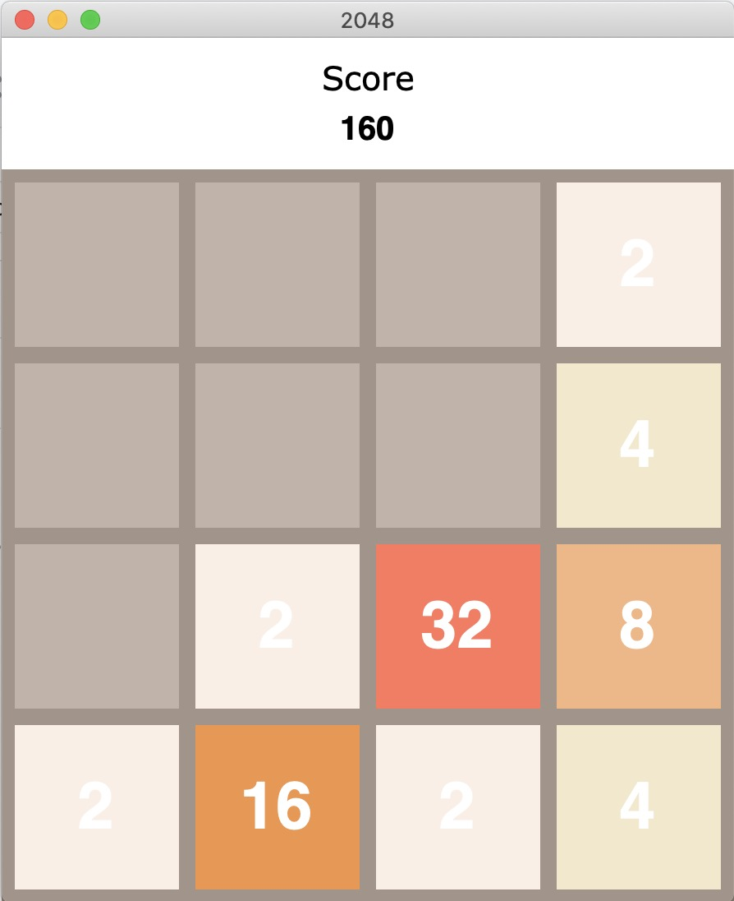

# 2048
"2048 is a single-player sliding block puzzle game designed by Italian web developer Gabriele Cirulli.
The objective of the game is to slide numbered tiles on a grid to combine them to create a tile with the number 2048."

  

Made using Python, with TKinter for the GUI.
